# <kbd>__Geometry__</kbd> 

​                                            __A CPP Template Library__

## ***0. Author***

<kbd>___Name___</kbd> csl  

<kbd>___E-Mmail___</kbd> 3079625093@qq.com

## ***1. Overview***

​	This CPP library mainly provides two dimension point template classes: <kbd>__Point2<_Ty>___</kbd> and <kbd>__Point3<_Ty>___</kbd>.It also provides related geometries and operations based on two kinds of points, such as conventional "write" operation, "read" operation and distance calculation of point set, and azimuth calculation based on point2. You can easily use it to assist development. And because it's a template class, you can just copy the head file to your project and use it. 
​	There are some details of this library below. And if you find some bugs or have some bright ideas for this library, please contact me through the E-Mail above.

## ***2. Code Structure***

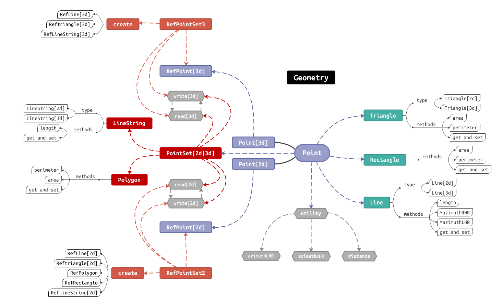

## ***3. Classes Belongs***


## ***4. Figures***

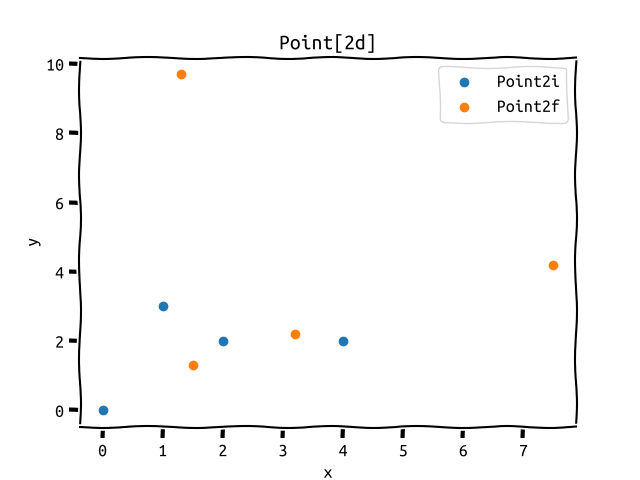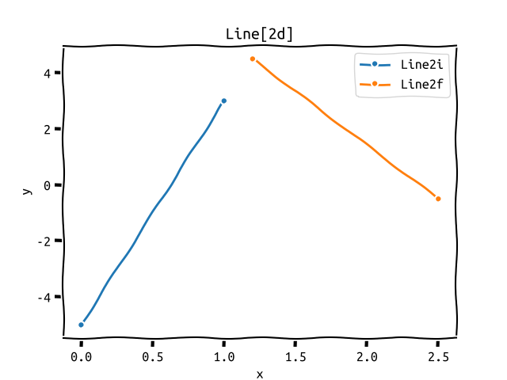

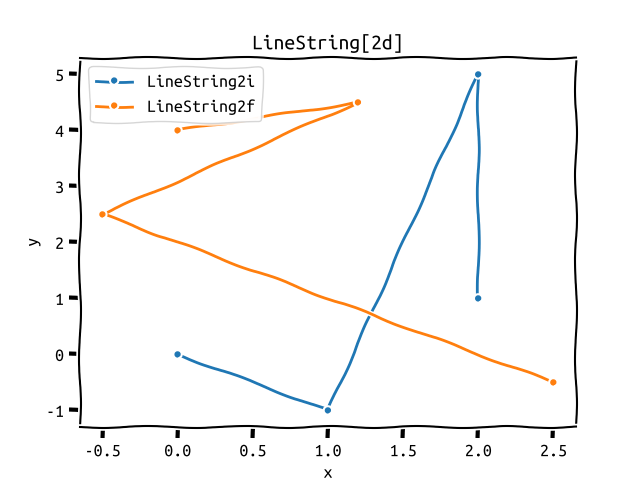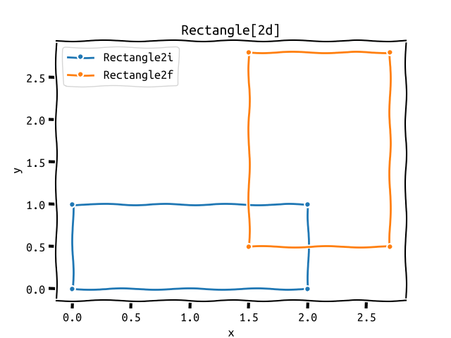

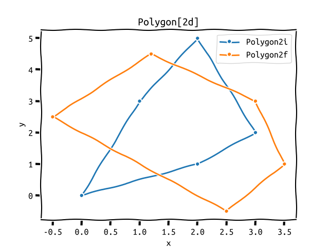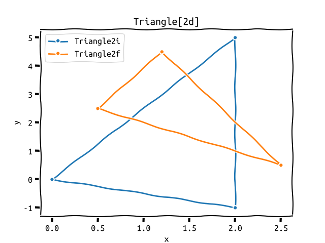

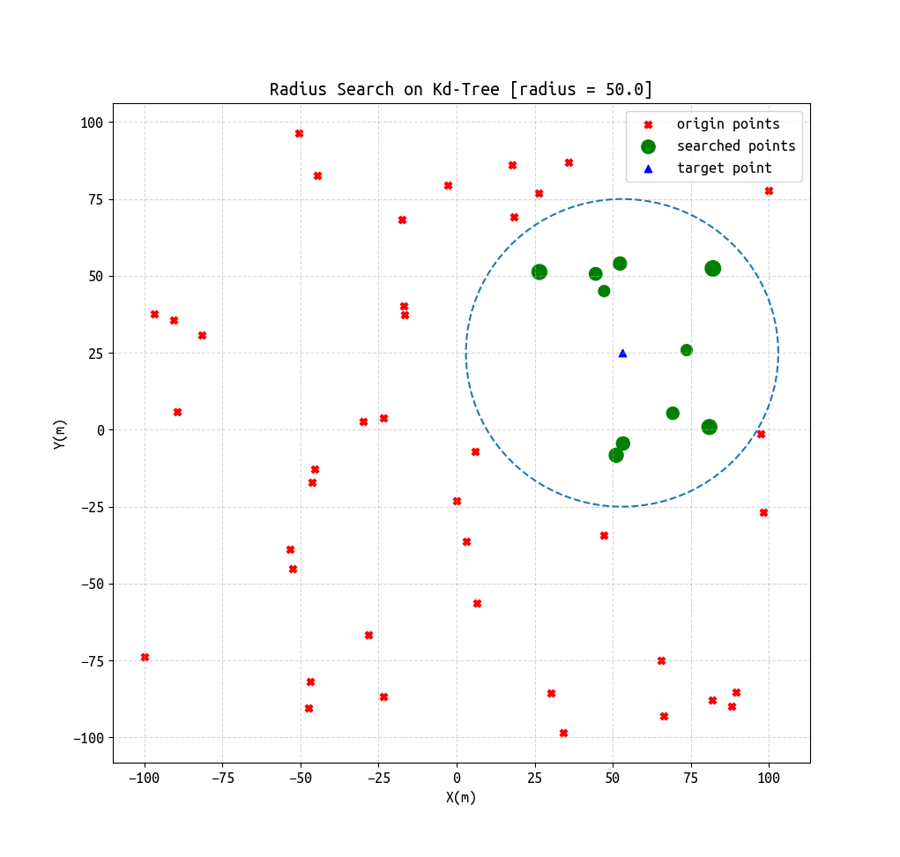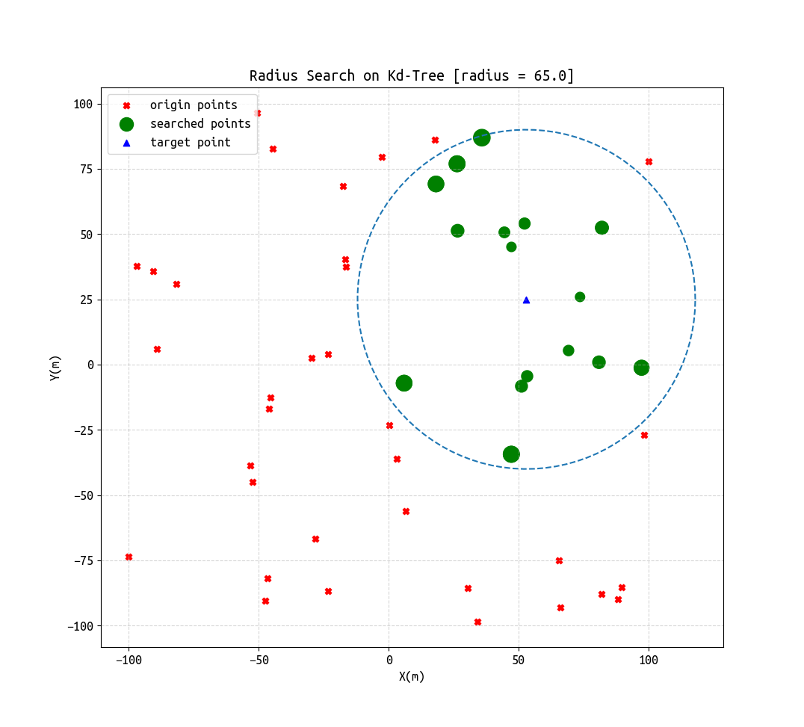

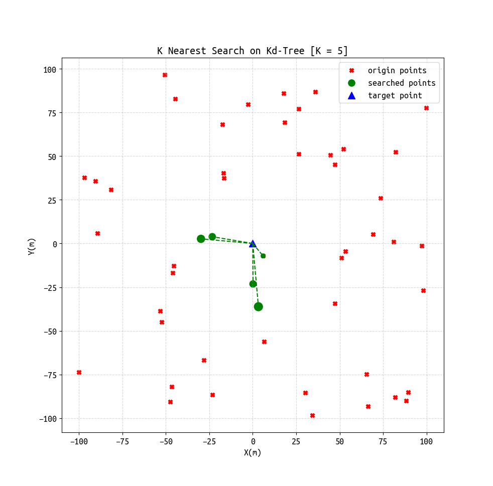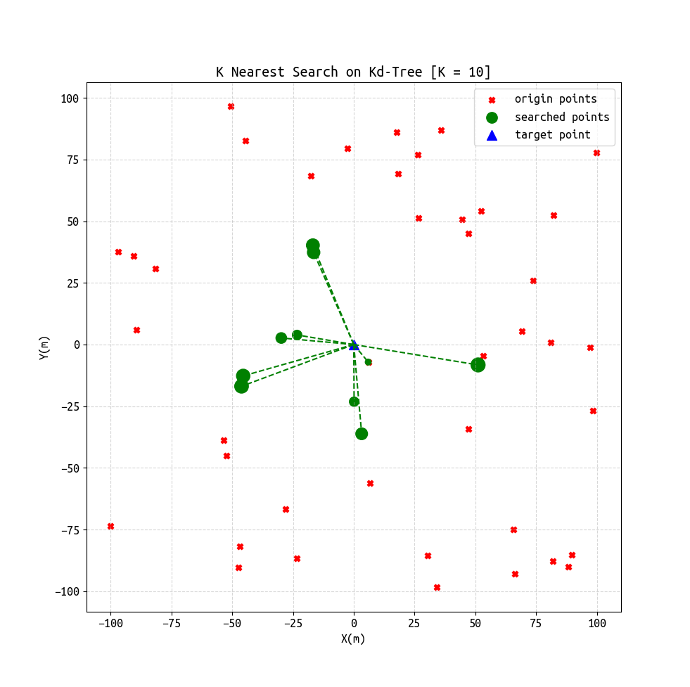


## ***5. Using example***

### <kbd>__Point2<_Ty>___</kbd>

```cpp
void foo_point2()
{
    PointSet2f ps;
    ps.push_back({0.6, 0.4});
    ps.push_back({1.9, 2.7});
    ps.push_back({0.6, 0.4});
    ps.push_back({1.9, 2.7});
    try
    {
        // distance between tow points
        std::cout << distance(ps.front(), ps.back()) << std::endl;
        // write and read point data
        // way one.
        // default write mode : std::ios::out | std::ios::binary
        ps.write("../output/point2.bin");
        ps.clear();
        // default read mode : std::ios::in | std::ios::binary
        ps.read("../output/point2.bin");
        // way two.
        // write mode : std::ios::out
        ps.write("../output/point2.txt", std::ios::out);
        ps.clear();
        // read mode : std::ios::in
        ps.read("../output/point2.txt", std::ios::in);
        // print points
        for (const auto &elem : ps)
        {
            std::cout << elem << std::endl;
        }
    }
    catch (const std::exception &e)
    {
        std::cerr << e.what() << '\n';
    }
    return;
}
/** output
 * 2.64197
 * [0.6, 0.4]
 * [1.9, 2.7]
 * [0.6, 0.4]
 * [1.9, 2.7]
 */
```

### <kbd>__Point3<_Ty>___</kbd>  

```cpp
void foo_point3()
{
    PointSet3f ps;
    ps.push_back({0.6, 0.4, 1.1});
    ps.push_back({1.9, 2.7, 2.3});
    ps.push_back({0.6, 0.4, 1.1});
    ps.push_back({1.9, 2.7, 2.3});
    try
    {
        // distance between tow points
        std::cout << distance(ps.front(), ps.back()) << std::endl;
        // write and read point data
        // way one.
        // default write mode : std::ios::out | std::ios::binary
        ps.write("../output/point3.bin");
        ps.clear();
        // default read mode : std::ios::in | std::ios::binary
        ps.read("../output/point3.bin");

        // way two.
        // write mode : std::ios::out
        ps.write("../output/point3.txt", std::ios::out);
        ps.clear();
        // read mode : std::ios::in
        ps.read("../output/point3.txt", std::ios::in);
        // print points
        for (const auto &elem : ps)
        {
            std::cout << elem << std::endl;
        }
    }
    catch (const std::exception &e)
    {
        std::cerr << e.what() << '\n';
    }
    return;
}
/** output
 * 2.90172
 * [0.6, 0.4, 1.1]
 * [1.9, 2.7, 2.3]
 * [0.6, 0.4, 3.5]
 * [1.9, 2.7, 4.6]
 */
```

### <kbd>__PointSet23<_Ty>___</kbd>  
```cpp
void foo_pointset23()
{
    PointSet2f ps;
    ps.push_back(Point2f(1, 2));
    ps.push_back(Point2f(2, 3));
    ps.write("../output/pointset.csv", std::ios::out);
    ps.clear();
    ps.read("../output/pointset.csv", std::ios::in);
    for (const auto &point : ps)
        std::cout << point << std::endl;
    return;
}
/** output
 * [1, 2]
 * [2, 3]
 */
```

### <kbd>__Point_cast<_Ty>___</kbd>  
```cpp
void foo_ponitCast_test()
{
    Point3f p(1, 2, 6);
    Point2f p2(2, 6);
    auto ary = static_cast<Point3f::ary_type>(p);
    auto ary2 = static_cast<Point2f::ary_type>(p2);

    std::cout << ary[0] << ',' << ary[1] << ',' << ary[2] << std::endl;
    std::cout << ary2[0] << ',' << ary2[1] << std::endl;

    std::cout << Point3f(ary) << std::endl;
    std::cout << Point2f(ary2) << std::endl;

    return;
}
/** output
 * 1,2,6
 * 2,6
 * [1, 2, 6]
 * [2, 6]
 */
```

### <kbd>__Triangle2<_Ty>___</kbd>  

```cpp
void foo_triangle2()
{
    ns_geo::Point2<double> points[3] = {
        Point2d(0, 0),
        Point2d(2, 2),
        Point2d(2, 0)};
    ns_geo::Triangle2d tri(points);
    std::cout << tri << std::endl;
    std::cout << "area : " << tri.area() << std::endl;
    std::cout << "perimeter : " << tri.perimeter() << std::endl;
    return;
}
/** output
 * {[0, 0], [2, 2], [2, 0]}
 * area : 2
 * perimeter : 6.82843
 */
```

### <kbd>__Triangle3<_Ty>___</kbd>  

```cpp
void foo_triangle3()
{
    ns_geo::Point3<double> points[3] = {
        Point3d(0, 0, 0),
        Point3d(2, 2, 2),
        Point3d(2, 0, 0)};
    ns_geo::Triangle3d tri(points);
    std::cout << tri << std::endl;
    std::cout << "area : " << tri.area() << std::endl;
    std::cout << "perimeter : " << tri.perimeter() << std::endl;
    return;
}
/** output
 * {[0, 0, 0], [2, 2, 2], [2, 0, 0]}
 * area : 2.82843
 * perimeter : 8.29253
 */
```

### <kbd>__Line2<_Ty>___</kbd>  

```cpp
void foo_line2()
{
    ns_geo::Line2d line(Point2d(0, 0), Point2d(2, 2));
    std::cout << line << std::endl;
    std::cout << "length : " << line.length() << std::endl;
    for (const auto &elem : line.points())
        std::cout << elem << std::endl;
    return;
}
/** output
 * {[0, 0], [2, 2]}
 * length : 2.82843
 * [0, 0]
 * [2, 2]
 */
```

### <kbd>__Line3<_Ty>___</kbd>  

```cpp
void foo_line3()
{
    ns_geo::Line3d line(Point3d(0, 0, 0), Point3d(2, 2, 2));
    std::cout << line << std::endl;
    std::cout << "length : " << line.length() << std::endl;
    for (const auto &elem : line.points())
        std::cout << elem << std::endl;
    return;
}
/** output
 * {[0, 0, 0], [2, 2, 2]}
 * length : 3.4641
 * [0, 0, 0]
 * [2, 2, 2]
 */
```

### <kbd>__Rectangle<_Ty>___</kbd>  

```cpp
void foo_rectangle()
{
    ns_geo::Rectangled rect(0, 4, 1, 0);
    std::cout << rect << std::endl;
    std::cout << "area : " << rect.area() << std::endl;
    std::cout << "peri : " << rect.perimeter() << std::endl;
    for (const auto &elem : rect.points())
        std::cout << elem << std::endl;
    return;
}
/** output
 * {[0, 4], [1, 0]}
 * area : 4
 * peri : 10
 * [0, 4]
 * [1, 0]
 */
```

### <kbd>__Polygon<_Ty>___</kbd>  

```cpp
void foo_polygon()
{
    Polygond polygon({Point2d(0, 0),
                      Point2d(0, 1),
                      Point2d(0.5, 2),
                      Point2d(1, 1),
                      Point2d(1, 0)});
    std::cout << polygon << std::endl;
    std::cout << "perimeter : " << polygon.perimeter() << std::endl;
    std::cout << "area : " << polygon.area() << std::endl;
    return;
}
/** output
  * {[0, 0], [0, 1], [0.5, 2], [1, 1], [1, 0]}
  * perimeter : 5.23607
  * area : 1.5
 */
```

### <kbd>__LineString23<_Ty>___</kbd>  

```cpp
void foo_lineString23()
{
    LineString3d ls({Point3d(0, 0, 9),
                     Point3d(0, 1, 9),
                     Point3d(1, 1, 9),
                     Point3d(1, 0, 9)});
    std::cout << ls << std::endl;
    std::cout << ls.length() << std::endl;
    LineString2d ls2({Point2d(0, 9),
                      Point2d(1, 9),
                      Point2d(1, 9),
                      Point2d(0, 9)});
    std::cout << ls2 << std::endl;
    std::cout << ls2.length() << std::endl;
    return;
}
/** output
 * {[0, 0, 9], [0, 1, 9], [1, 1, 9], [1, 0, 9]}
 * 3
 * {[0, 9], [1, 9], [1, 9], [0, 9]}
 * 2
 */
```

### <kbd>__RefPoint23<_Ty>___</kbd>  

```cpp
void foo_refpoint23()
{
    double ary1[3] = {1, 2, 3};
    RefPoint3d p1(0, RefPoint3d::ary_type{0, 0, 0});
    RefPoint3d p2(1, ary1);
    std::cout << distance(p1, p2) << std::endl;
    std::cout << p1 << std::endl;

    double ary2[2] = {2, 3};
    RefPoint2d p3(0, RefPoint2d::ary_type{0, 0});
    RefPoint2d p4(1, ary2);
    std::cout << distance(p3, p4) << std::endl;
    std::cout << p3 << std::endl;
}
/** output
 * 3.74166
 * {0: [0, 0, 0]}
 * 3.60555
 * {0: [0, 0]}
 */
```

### <kbd>__RefPointSet23<_Ty>___</kbd>  

```cpp
void foo_refpointset23()
{
    double ary2[2] = {2, 3};
    RefPointSet2d rps2;
    rps2.insert({0, RefPoint2d::ary_type{0, 0}});
    rps2.insert({1, ary2});
    rps2.insert({2, RefPoint2d::ary_type{0, 0}});
    rps2.insert({4, ary2});
    for (const auto &refp : rps2)
        std::cout << refp.second << std::endl;
    std::cout << rps2.size() << std::endl;

    RefPointSet3d rps3;
    rps3.insert({0, RefPoint3d::ary_type{0, 0, 0}});
    rps3.insert({1, RefPoint3d::ary_type{0, 1, 0}});
    rps3.insert({2, RefPoint3d::ary_type{0, 0, 1}});
    rps3.insert({3, RefPoint3d::ary_type{1, 0, 0}});
    for (const auto &refp : rps3)
        std::cout << refp.second << std::endl;
    std::cout << rps3.size() << std::endl;
}
/** output
 * {0: [0, 0]}
 * {2: [0, 0]}
 * {4: [2, 3]}
 * {1: [2, 3]}
 * 4
 * {4: [1, 0, 0]}
 * {2: [0, 0, 1]}
 * {1: [0, 1, 0]}
 * {0: [0, 0, 0]}
 * 4
 */
```

### <kbd>__RefLine23<_Ty>___</kbd>  
```cpp
void foo_refline2()
{
    double ary2[2] = {2, 3};
    RefPointSet2d rps;
    rps.insert({0, RefPoint2d::ary_type{0, 0}});
    rps.insert({1, ary2});
    rps.insert({2, RefPoint2d::ary_type{0, 0}});
    rps.insert({4, ary2});
    for (const auto &refp : rps)
        std::cout << refp.second << std::endl;
    
    auto refline = rps.createRefLine2(0, 1);
    std::cout << refline << std::endl;
    std::cout << refline.length() << std::endl;
}
/** output
 * {0: [0, 0]}
 * {2: [0, 0]}
 * {4: [2, 3]}
 * {1: [2, 3]}
 * {0: [0, 0], 1: [2, 3]}
 * 3.60555
 */

void foo_refline3()
{
    RefPointSet3d rps;
    rps.insert({0, RefPoint3d::ary_type{0, 0, 0}});
    rps.insert({1, RefPoint3d::ary_type{0, 1, 0}});
    rps.insert({2, RefPoint3d::ary_type{0, 0, 1}});
    rps.insert({3, RefPoint3d::ary_type{1, 0, 0}});
    for (const auto &refp : ps)
        std::cout << refp.second << std::endl;
    
    auto refline = rps.createRefLine3(0, 1);
    std::cout << refline << std::endl;
    std::cout << refline.length() << std::endl;
    auto ary = refline.points();
}
/** output
 * {0: [0, 0, 0]}
 * {2: [0, 0, 1]}
 * {4: [1, 0, 0]}
 * {1: [0, 1, 0]}
 * {0: [0, 0, 0], 1: [0, 1, 0]}
 * 1
 */
```


### <kbd>__RefRectangle<_Ty>___</kbd>  

```cpp
void foo_refrectangle()
{
    double ary2[2] = {2, 3};
    RefPointSet2d rps;
    rps.insert({0, RefPoint2d::ary_type{0, 0}});
    rps.insert({1, ary2});
    rps.insert({2, RefPoint2d::ary_type{0, 0}});
    rps.insert({4, ary2});
    for (const auto &refp : rps)
        std::cout << refp.second << std::endl;
    
    auto rect = rps.createRefRectangle(0, 1);
    std::cout << rect << std::endl;
    std::cout << rect.area() << std::endl;
    std::cout << rect.perimeter() << std::endl;
}
/** output
 * {0: [0, 0]}
 * {2: [0, 0]}
 * {4: [2, 3]}
 * {1: [2, 3]}
 * {0: [0, 0], 1: [2, 3]}
 * 6
 * 10
 */
```

### <kbd>__RefTriangle23<_Ty>___</kbd>  

```cpp
void foo_reftriangle2()
{
    double ary2[2] = {2, 3};
    RefPointSet2d rps;
    rps.insert({0, RefPoint2d::ary_type{0, 0}});
    rps.insert({1, ary2});
    rps.insert({2, RefPoint2d::ary_type{0, 0}});
    rps.insert({4, ary2});
    for (const auto &refp : rps)
        std::cout << refp.second << std::endl;
    auto tri = rps.createRefTriangle2(0, 1, 2);
    
    std::cout << tri << std::endl;
    std::cout << tri.perimeter() << std::endl;
    std::cout << tri.area() << std::endl;
}
/** output
 * {0: [0, 0]}
 * {2: [0, 2]}
 * {4: [3, 0]}
 * {1: [1, 0]}
 * {0: [0, 0], 1: [1, 0], 2: [0, 2]}
 * 5.23607
 * 1
 */

void foo_reftriangle3()
{
    RefPointSet3d rps;
    rps.insert({0, RefPoint3d::ary_type{0, 0, 0}});
    rps.insert({1, RefPoint3d::ary_type{0, 1, 0}});
    rps.insert({2, RefPoint3d::ary_type{0, 0, 1}});
    rps.insert({3, RefPoint3d::ary_type{1, 0, 0}});
    for (const auto &refp : rps)
        std::cout << refp.second << std::endl;
    
    auto tri = rps.createRefTriangle3(0, 1, 2);
    std::cout << tri << std::endl;
    std::cout << tri.area() << std::endl;
    std::cout << tri.perimeter() << std::endl;
}
/** output
 * {0: [0, 0, 0]}
 * {2: [0, 0, 1]}
 * {4: [1, 0, 0]}
 * {1: [0, 1, 0]}
 * {0: [0, 0, 0], 1: [0, 1, 0], 2: [0, 0, 1]}
 * 0.5
 * 3.41421
 */
```

### <kbd>__RefPolygon<_Ty>___</kbd>  

```cpp
void foo_refpolygon()
{
    RefPointSet2d rps;
    rps.insert({0, RefPoint2d::ary_type{0, 0}});
    rps.insert({1, RefPoint2d::ary_type{1, 0}});
    rps.insert({2, RefPoint2d::ary_type{1, 1}});
    rps.insert({4, RefPoint2d::ary_type{0, 1}});
    
    auto polygon = rps.createRefPolygon({0, 1, 2, 4});
    std::cout << polygon << std::endl;
    std::cout << "perimeter : " << polygon.perimeter() << std::endl;
}
/** output
 * {0: [0, 0], 1: [1, 0], 2: [1, 1], 4: [0, 1]}
 * perimeter : 4
 */
```

### <kbd>__RefLinestring23<_Ty>___</kbd>  

```cpp
void foo_reflinestring2()
{
    RefPointSet2d rps;
    rps.insert({0, RefPoint2d::ary_type{0, 0}});
    rps.insert({1, RefPoint2d::ary_type{1, 0}});
    rps.insert({2, RefPoint2d::ary_type{1, 1}});
    rps.insert({4, RefPoint2d::ary_type{0, 1}});
    
    auto ls = rps.createRefLineString2({0, 1, 2, 4});
    std::cout << ls << std::endl;
    std::cout << "length : " << ls.length() << std::endl;
}
/** output
 * {0: [0, 0], 1: [1, 0], 2: [1, 1], 4: [0, 1]}
 * length : 3
 */

void foo_reflinestring3()
{
    RefPointSet3d rps;
    rps.insert({0, RefPoint3d::ary_type{0, 0, 0}});
    rps.insert({1, RefPoint3d::ary_type{0, 1, 0}});
    rps.insert({2, RefPoint3d::ary_type{0, 0, 1}});
    rps.insert({3, RefPoint3d::ary_type{1, 0, 0}});
    
    auto ls = rps.createRefLineString3({0, 1, 2, 4});
    std::cout << ls << std::endl;
    std::cout << "length : " << ls.length() << std::endl;
}
 /** output
  * {0: [0, 0, 0], 1: [0, 1, 0], 2: [0, 0, 1], 4: [1, 0, 0]}
  * length : 3.82843
  */
```

### <kbd>__RefPointSet_WriteRead23<_Ty>___</kbd>  

```cpp
void foo_refpointset2_write()
{
    RefPointSet2d rps;
    rps.insert({0, RefPoint2d::ary_type{0, 0}});
    rps.insert({1, RefPoint2d::ary_type{1, 0}});
    rps.insert({2, RefPoint2d::ary_type{1, 1}});
    rps.insert({4, RefPoint2d::ary_type{0, 1}});
    
    rps.write("../output/refpointset2.bin");
    rps.clear();
    rps.read("../output/refpointset2.bin");
    for (const auto &[id, refp] : rps)
        std::cout << refp << std::endl;
}
/** output
 * {1: [1, 0]}
 * {4: [0, 1]}
 * {2: [1, 1]}
 * {0: [0, 0]}
 */
void foo_refpointset3_write()
{
    RefPointSet3d rps;
    rps.insert({0, RefPoint3d::ary_type{0, 0, 0}});
    rps.insert({1, RefPoint3d::ary_type{0, 1, 0}});
    rps.insert({2, RefPoint3d::ary_type{0, 0, 1}});
    rps.insert({3, RefPoint3d::ary_type{1, 0, 0}});
    
    rps.write("../output/refpointset3.bin");
    rps.clear();
    rps.read("../output/refpointset3.bin");
    for (const auto &[id, refp] : rps)
        std::cout << refp << std::endl;
}
/** output
 * {1: [0, 1, 0]}
 * {4: [1, 0, 0]}
 * {2: [0, 0, 1]}
 * {0: [0, 0, 0]}
 */
```

### <kbd>__distance___</kbd>  

```cpp
void foo_distance()
{
    Point2d p1(1, 1);
    Point2d p2(2, 2);
    Line2d line({0, 0, 0, 1});
    std::cout << "p1 -> p2 : " << distance(p1, p2) << std::endl;
    std::cout << "p1 -> line : " << distance(p1, line) << std::endl;
    double ary2[2] = {2, 3};
    RefPointSet2d rps;
    rps.insert({0, RefPoint2d::ary_type{0, 0}});
    rps.insert({1, ary2});
    rps.insert({2, RefPoint2d::ary_type{0, 0}});
    rps.insert({4, ary2});
    auto refline = rps.createRefLine2(0, 1);
    std::cout << "p1 -> refline : " << distance(p1, Line2d(refline)) << std::endl;
    return;
}
/** output
 * p1 -> p2 : 1.41421
 * p1 -> line : 1
 * p1 -> refline : 0.27735
 */
```

### <kbd>__kdtree__</kbd>  

```cpp
void foo_kdtree()
{
    PointSet3f ps({{3, 1, 4},
                   {2, 3, 7},
                   {2, 0, 3},
                   {2, 4, 5},
                   {1, 4, 4},
                   {0, 5, 7}});
    KdTree3<Point3f> kdtree(ps);
    kdtree.printKdTree();
    return;
}
/** output
 * [2, 4, 5]:[Y] [3, 1, 4]:[Z] [2, 0, 3]:[X] [2, 3, 7]:[X] [0, 5, 7]:[Z] [1, 4, 4]:[X]
 */
void foo_refkdtree()
{
    RefPointSet3f ps;
    ps.insert({0, 3, 1, 4});
    ps.insert({1, 2, 3, 7});
    ps.insert({2, 2, 0, 3});
    ps.insert({3, 2, 4, 5});
    ps.insert({4, 1, 4, 4});
    ps.insert({5, 0, 5, 7});
    RefKdTree3f kdtree(ps);
    kdtree.printKdTree();
    return;
}
/** output
 * {4: [1, 4, 4]}:[Y] {0: [3, 1, 4]}:[Z] {2: [2, 0, 3]}:[X] {1: [2, 3, 7]}:[X] {5: [0, 5, 7]}:[Z] {3: [2, 4, 5]}:[X]
 */
void foo_kdtreeRadiusSearch()
{
    PointSet2f ps({{2, 3},
                   {5, 4},
                   {9, 6},
                   {4, 7},
                   {8, 1},
                   {7, 2}});
    KdTree2f Kdtree(ps);
    Kdtree.printKdTree();
    std::vector<float> dis;
    std::vector<Point2f> sps;
    Kdtree.radiusSearch({6, 5}, 4, sps, dis);
    for (int i = 0; i != dis.size(); ++i)
        std::cout << sps.at(i) << ' ' << dis.at(i) << std::endl;
    return;
}
/** output
 * [7, 2]:[X] [5, 4]:[Y] [2, 3]:[X] [4, 7]:[X] [9, 6]:[Y] [8, 1]:[X] 
 * [4, 7] 2.82843
 * [5, 4] 1.41421
 * [7, 2] 3.16228
 * [9, 6] 3.16228
 */
void foo_kdtreeNearestKSearch()
{
    std::default_random_engine e;
    std::uniform_real_distribution<float> u(-100.0f, 100.0f);
    PointSet2f ps;
    std::fstream file1("../pyDrawer/kdtree/nearest1.csv", std::ios::out);
    std::fstream file2("../pyDrawer/kdtree/nearest2.csv", std::ios::out);
    for (int i = 0; i != 50; ++i)
    {
        ps.push_back({u(e), u(e)});
        file1 << ps.back().x() << ',' << ps.back().y() << std::endl;
    }
    KdTree2f kdtree(ps);
    std::vector<float> dis;
    std::vector<Point2f> sps;
    kdtree.nearestKSearch({0, 0}, 6, sps, dis);
    for (int i = 0; i != dis.size(); ++i)
        file2 << sps.at(i).x() << ',' << sps.at(i).y() << ',' << dis.at(i) << std::endl;
    return;
}
```

For other implementation details, please refer to the source code.